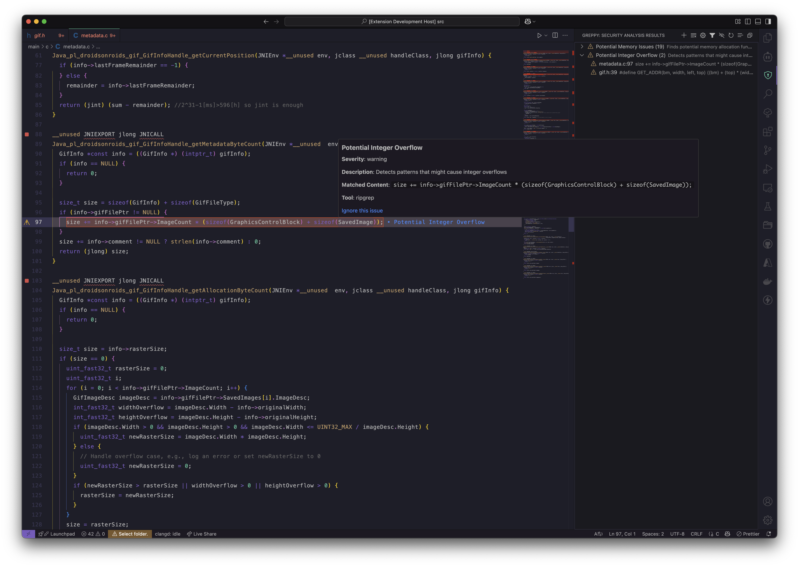

<div align="center">
  
</div>

<div align="center">
  <h1>Greppy</h1>
  <p><strong>A continuous static analysis tool for Visual Studio Code with a focus on security.</strong></p>
  <p>Define and run security-focused search patterns across your codebase using ripgrep or weggli.</p>
</div>

<p align="center">
  
</p>

<div align="center">
  <a href="#-features">Features</a> •
  <a href="#-requirements">Requirements</a> •
  <a href="#-extension-settings">Settings</a> •
  <a href="#-example-patterns">Examples</a> •
  <a href="#-usage">Usage</a> •
  <a href="#-extension-development">Development</a>
</div>

---

## ✨ Features

- 🔍 Define custom search patterns using ripgrep or weggli
- 🏷️ Organize findings by pattern with severity levels
- 🖱️ Click on findings to navigate directly to the corresponding code
- 🔄 Automatic analysis of your workspace
- 🌐 Support for C, C++, and any other language that can be analyzed with text patterns
- 🚫 Ability to ignore/acknowledge findings that aren't relevant

## 🛠️ Requirements

- ripgrep (`rg`) must be installed for ripgrep patterns
- weggli must be installed for weggli patterns (optional)

You can install these tools using:

```bash
# For ripgrep
# macOS
brew install ripgrep

# Ubuntu/Debian
apt-get install ripgrep

# For weggli
cargo install weggli
```

## ⚙️ Extension Settings

This extension contributes the following settings:

* `greppy.patterns`: Array of pattern configurations to run against your codebase
* `greppy.ripgrepPath`: Path to the ripgrep executable (default: "rg")
* `greppy.weggliPath`: Path to the weggli executable (default: "weggli")

### 📝 Pattern Configuration

Each pattern in the `greppy.patterns` array should have the following structure:

```json
{
  "name": "Vulnerable Memcpy Usage",
  "description": "Detects potentially vulnerable memcpy calls",
  "tool": "weggli",
  "pattern": "{ _ $buf[_]; memcpy($buf,_,_); }",
  "options": ["-X"],
  "severity": "critical"
}
```

Available fields:

- `name`: Pattern name (displayed in results)
- `description`: Description of what the pattern checks for
- `tool`: Either "ripgrep" or "weggli"
- `pattern`: The search pattern for the specified tool
- `options`: (Optional) Array of command-line options to pass to the tool
- `severity`: Severity level - "info", "warning", or "critical"

### 🧩 Pattern Sets

Greppy includes built-in pattern sets organized by technology:

- `general`: Basic security patterns for all codebases
- `cpp`: Security patterns for C and C++ development
- `web`: Security patterns for web applications

You can:

1. **Select a pattern set** using the command palette: "Greppy: Select Pattern Set"
2. **Add a pattern to a set** using the command palette: "Greppy: Add Pattern to Set" - this provides a guided UI for adding patterns
3. **Extend existing pattern sets** by adding patterns to `greppy.patternSets` in settings:

```json
"greppy.patternSets": {
  "cpp": [
    {
      "name": "My Custom C++ Pattern",
      "description": "Checks for unsafe C++ code",
      "tool": "ripgrep",
      "pattern": "unsafeFunction\\(",
      "severity": "critical"
    }
  ]
}
```

This will add your pattern to the built-in C++ patterns rather than replacing them.

3. **Create custom pattern sets** by adding new named sets:

```json
"greppy.patternSets": {
  "my-framework": [
    {
      "name": "Framework-specific Issue",
      "description": "Detects issues in my framework",
      "tool": "ripgrep",
      "pattern": "riskyFrameworkCall\\(",
      "severity": "warning"
    }
  ]
}
```

## 📋 Example Patterns

### 🔎 Ripgrep Patterns

```json
{
  "name": "Hard-coded Credentials",
  "description": "Finds hard-coded passwords and API keys",
  "tool": "ripgrep",
  "pattern": "(password|api.?key)\\s*=\\s*['\"](\\w|[[:punct:]]){5,}['\"]",
  "severity": "critical"
}
```

```json
{
  "name": "SQL Injection Risk",
  "description": "Detects potential SQL injection vulnerabilities",
  "tool": "ripgrep",
  "pattern": "execute\\(.*\\$.*\\)",
  "severity": "warning"
}
```

### 🔬 Weggli Patterns

```json
{
  "name": "Vulnerable Buffer Operations",
  "description": "Finds stack buffer operations with potential overflow",
  "tool": "weggli",
  "pattern": "{ _ $buf[_]; $func($buf,_); }",
  "options": [],
  "severity": "critical"
}
```

```json
{
  "name": "Missing NULL Check",
  "description": "Finds pointer dereferences without NULL checks",
  "tool": "weggli",
  "pattern": "{ _* $p; not: if ($p == NULL) _; not: if ($p != NULL) _; *$p; }",
  "severity": "warning"
}
```

## 📖 Usage

1. Configure your patterns in VS Code settings
2. Open the command palette (`Ctrl+Shift+P` or `Cmd+Shift+P` on macOS)
3. Run the "Greppy: Run Security Analysis" command
4. View results in the Greppy Results panel in the Explorer sidebar
5. Click on findings to navigate to the corresponding code
6. Hover over a finding to see more details or ignore it if it's not relevant

## 👨‍💻 Extension Development

### 🏗️ Building and Packaging

1. Clone this repository
   ```bash
   git clone https://github.com/posidron/greppy.git
   cd greppy
   ```

2. Install dependencies
   ```bash
   npm install
   ```

3. Build the extension
   ```bash
   npm run package
   ```

4. Create a VSIX package
   ```bash
   # Install the vsce packaging tool if you don't have it
   npm install -g @vscode/vsce

   # Create the package
   vsce package
   ```
   This will generate a `greppy-0.0.1.vsix` file (or similar, depending on the version).

### 🧪 Running Tests

Greppy has a comprehensive test suite to ensure the extension functions correctly. The tests cover the core functionality, such as filtering findings, the tree view display, and the decoration service.

1. Install test dependencies
   ```bash
   npm install
   ```

2. Compile the tests
   ```bash
   npm run compile-tests
   ```

3. Run the tests
   ```bash
   npm test
   ```

4. For development, you can watch for changes and automatically recompile tests
   ```bash
   npm run watch-tests
   ```


If you're adding new features, please make sure to add corresponding tests to maintain code quality.

### 📦 Installing the Extension

#### From VSIX File
1. Open VS Code
2. Go to the Extensions view (Ctrl+Shift+X or Cmd+Shift+X on macOS)
3. Click on the "..." menu in the top right of the Extensions view
4. Select "Install from VSIX..."
5. Navigate to and select the `greppy-0.0.1.vsix` file

#### For Development
1. Open the project in VS Code
2. Press F5 to open a new window with the extension loaded
3. Run "Greppy: Run Security Analysis" to test the extension

### ❓ Troubleshooting

If you encounter an error like "Extension 'Mantiqo.greppy' not found":
1. Make sure you've correctly built and installed the extension as described above
2. Check that the `publisher` field in `package.json` matches the publisher name used in the error message
3. Try reloading VS Code after installation

## 🤝 Contributing

Contributions are welcome! Feel free to submit a Pull Request.

1. Fork the repository
2. Create your feature branch (`git checkout -b feature/amazing-feature`)
3. Commit your changes (`git commit -m 'Add some amazing feature'`)
4. Push to the branch (`git push origin feature/amazing-feature`)
5. Open a Pull Request

## 📄 License

This project is licensed under the MIT License.


