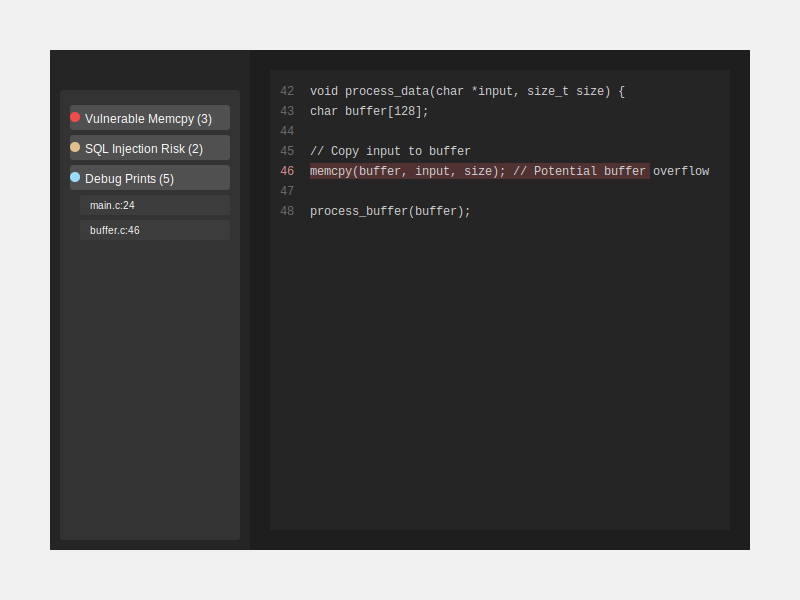

# Greppy

Greppy is a continuous static analysis tool for Visual Studio Code with a focus on security. It enables you to define and run security-focused search patterns across your codebase using either ripgrep or weggli.



## Features

- Define custom search patterns using ripgrep or weggli
- Organize findings by pattern with severity levels
- Click on findings to navigate directly to the corresponding code
- Automatic analysis of your workspace
- Support for C, C++, and any other language that can be analyzed with text patterns

## Requirements

- ripgrep (`rg`) must be installed for ripgrep patterns
- weggli must be installed for weggli patterns (optional)

You can install these tools using:

```bash
# For ripgrep
# macOS
brew install ripgrep

# Ubuntu/Debian
apt-get install ripgrep

# For weggli
cargo install weggli
```

## Extension Settings

This extension contributes the following settings:

* `greppy.patterns`: Array of pattern configurations to run against your codebase
* `greppy.ripgrepPath`: Path to the ripgrep executable (default: "rg")
* `greppy.weggliPath`: Path to the weggli executable (default: "weggli")

### Pattern Configuration

Each pattern in the `greppy.patterns` array should have the following structure:

```json
{
  "name": "Vulnerable Memcpy Usage",
  "description": "Detects potentially vulnerable memcpy calls",
  "tool": "weggli",
  "pattern": "{ _ $buf[_]; memcpy($buf,_,_); }",
  "options": ["-X"],
  "severity": "critical"
}
```

Available fields:

- `name`: Pattern name (displayed in results)
- `description`: Description of what the pattern checks for
- `tool`: Either "ripgrep" or "weggli"
- `pattern`: The search pattern for the specified tool
- `options`: (Optional) Array of command-line options to pass to the tool
- `severity`: Severity level - "info", "warning", or "critical"

## Example Patterns

### Ripgrep Patterns

```json
{
  "name": "Hard-coded Credentials",
  "description": "Finds hard-coded passwords and API keys",
  "tool": "ripgrep",
  "pattern": "(password|api.?key)\\s*=\\s*['\"](\\w|[[:punct:]]){5,}['\"]",
  "severity": "critical"
}
```

```json
{
  "name": "SQL Injection Risk",
  "description": "Detects potential SQL injection vulnerabilities",
  "tool": "ripgrep",
  "pattern": "execute\\(.*\\$.*\\)",
  "severity": "warning"
}
```

### Weggli Patterns

```json
{
  "name": "Vulnerable Buffer Operations",
  "description": "Finds stack buffer operations with potential overflow",
  "tool": "weggli",
  "pattern": "{ _ $buf[_]; $func($buf,_); }",
  "options": [],
  "severity": "critical"
}
```

```json
{
  "name": "Missing NULL Check",
  "description": "Finds pointer dereferences without NULL checks",
  "tool": "weggli",
  "pattern": "{ _* $p; not: if ($p == NULL) _; not: if ($p != NULL) _; *$p; }",
  "severity": "warning"
}
```

## Usage

1. Configure your patterns in VS Code settings
2. Open the command palette (`Ctrl+Shift+P` or `Cmd+Shift+P` on macOS)
3. Run the "Greppy: Run Security Analysis" command
4. View results in the Greppy Results panel in the Explorer sidebar
5. Click on findings to navigate to the corresponding code

## Extension Development

1. Clone this repository
2. Run `npm install`
3. Press F5 to open a new window with your extension loaded
4. Run "Greppy: Run Security Analysis" to test the extension

## Known Issues

- weggli support requires the tool to be installed separately
- Performance may degrade with very large codebases or numerous patterns

## Release Notes

### 0.0.1

- Initial release of Greppy
- Support for ripgrep and weggli pattern analysis
- Results view with clickable findings

```
npm install -g yo generator-code
yo code
```


This is the README for your extension "greppy". After writing up a brief description, we recommend including the following sections.

## Features

Describe specific features of your extension including screenshots of your extension in action. Image paths are relative to this README file.

For example if there is an image subfolder under your extension project workspace:

\!\[feature X\]\(images/feature-x.png\)

> Tip: Many popular extensions utilize animations. This is an excellent way to show off your extension! We recommend short, focused animations that are easy to follow.

## Requirements

If you have any requirements or dependencies, add a section describing those and how to install and configure them.

## Extension Settings

Include if your extension adds any VS Code settings through the `contributes.configuration` extension point.

For example:

This extension contributes the following settings:

* `myExtension.enable`: Enable/disable this extension.
* `myExtension.thing`: Set to `blah` to do something.

## Known Issues

Calling out known issues can help limit users opening duplicate issues against your extension.

## Release Notes

Users appreciate release notes as you update your extension.

### 1.0.0

Initial release of ...

### 1.0.1

Fixed issue #.

### 1.1.0

Added features X, Y, and Z.

---

## Following extension guidelines

Ensure that you've read through the extensions guidelines and follow the best practices for creating your extension.

* [Extension Guidelines](https://code.visualstudio.com/api/references/extension-guidelines)

## Working with Markdown

You can author your README using Visual Studio Code. Here are some useful editor keyboard shortcuts:

* Split the editor (`Cmd+\` on macOS or `Ctrl+\` on Windows and Linux).
* Toggle preview (`Shift+Cmd+V` on macOS or `Shift+Ctrl+V` on Windows and Linux).
* Press `Ctrl+Space` (Windows, Linux, macOS) to see a list of Markdown snippets.

## For more information

* [Visual Studio Code's Markdown Support](http://code.visualstudio.com/docs/languages/markdown)
* [Markdown Syntax Reference](https://help.github.com/articles/markdown-basics/)

**Enjoy!**
